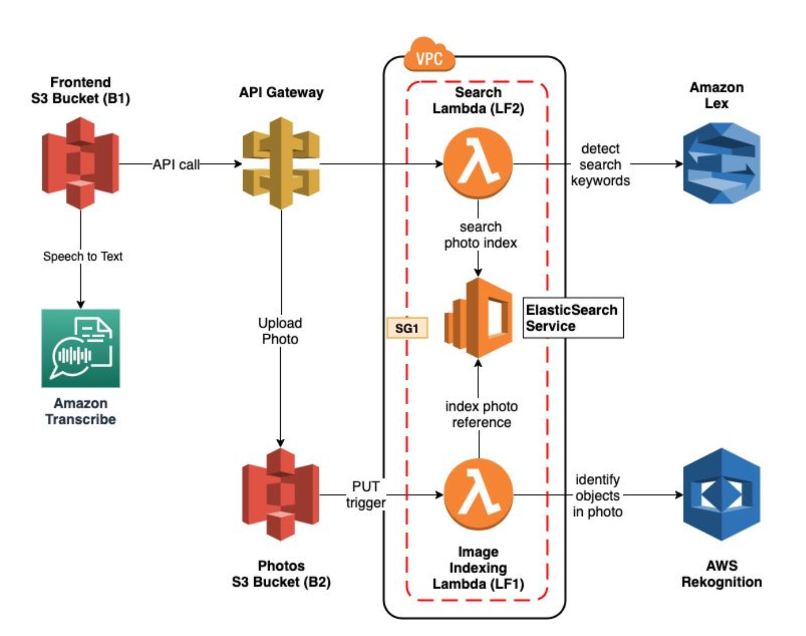

# Photo-Album-WebApp

A photo album web application, that can be searched using natural language through both text and voice. This application is built using the AWS services Lex, ElasticSearch, and Rekognition to create an intelligent search layer to query photos for people, objects, actions, landmarks and more.

The application user can upload photos which will be processed and stored in cloud storage for future use. User can also search for photos using keywords of objects contained in the photo, using the search text box or the voice search options. The photos are stored and accessed within a VPC to provide enhanced security. 

Application can be deployed to cloud at any time using the CloudFormation template that is available in the repository.

### Architecture Diagram

